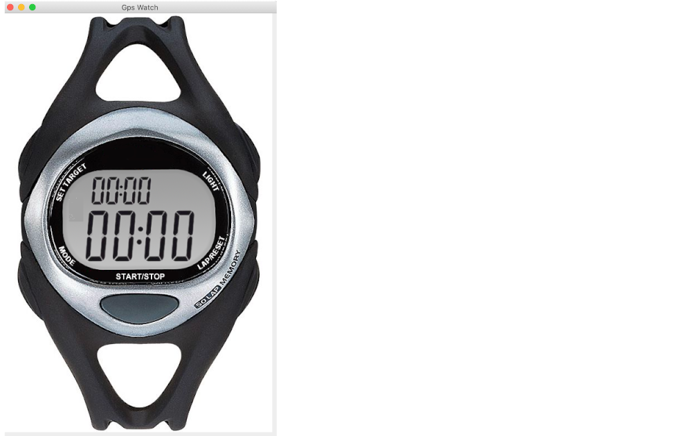

# GPS Watch

Multi-domain example with interdomain communication and interface with hand
written code.  This example includes a Java Swing GUI application and a
terminal based (ASCII) GUI.

## To build the project:

Build the project with maven
```
mvn install
```

## To run the project

Launch the GUI (Swing)
```
bash gui.sh
```

_**or**_

Launch the GUI (console)
```
bash gui.sh --console
```

In a new terminal window, launch the application
```
bash run.sh
```

## To browse/edit the project in BridgePoint

1. Launch a recent version of BridgePoint (download nightly build
   [here](https://s3.amazonaws.com/xtuml-releases/nightly-build/buildfiles.html))
2. Import the `runtime` project from the
   `$HOME/.m2/repository/io/ciera/runtime/2.6.2/runtime-2.6.2.jar` file.
3. Import the `GPS_Watch`, `HeartRateMonitor`, `Location`, `Tracking`, and `UI`
   projects from this folder (disable "Search for nested projects")

## GUI (Swing)



## GUI (console)

```
            ___-----------___
           /                 \
          /                   \
       /\/   ______---______   \/\
       \/   /               \   \/
       {   /  0      meters  \   }
       |  {    _  _   _  _    }  |-,
       |  |   | || |.| || |   |  | |
       |  {   |_||_|.|_||_|   }  |-'
       {   \                 /   }
       /\   `------___------'   /\
(m)ode \/\        _____        /\/ (r)eset/lap
          \   (s)tart/stop    /
           \     \_____/     /
            ---___________---

E(x)it
______________________________________________
Waiting for connection
```
